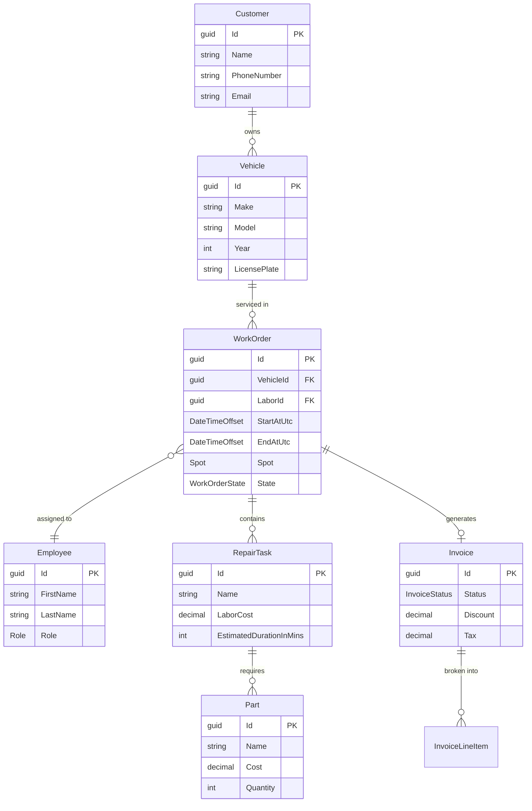

<div align="center">

# 🔧 MechanicShop Workshop

### Enterprise-Grade Automotive Workshop Management System

[](https://github.com/Youssef-AbdelRaafi/MechanicShopWorkshop/actions/workflows/build-and-test.yml)
[](https://dotnet.microsoft.com/)
[](https://dotnet.microsoft.com/apps/aspnet/web-apps/blazor)
[](https://learn.microsoft.com/en-us/ef/core/)
[](https://www.microsoft.com/sql-server)
[](https://www.docker.com/)
[](LICENSE)

<br/>

*A production-ready, full-stack workshop management platform built with **Clean Architecture**, **Domain-Driven Design (DDD)**, and **CQRS** — designed for real-world automotive service operations.*

<br/>

[Features](#-features) · [Architecture](#-architecture) · [Tech Stack](#-tech-stack) · [Getting Started](#-getting-started) · [API Reference](#-api-reference) · [Testing](#-testing) · [Observability](#-observability)

</div>

---

## 📋 Overview

**MechanicShop Workshop** is a comprehensive workshop management system that streamlines every aspect of running an automotive repair business — from scheduling work orders and tracking repair tasks to generating invoices and monitoring operations in real time.

Built with enterprise-grade architectural patterns and modern .NET technologies, the system demonstrates professional software engineering practices including Clean Architecture, Domain-Driven Design, CQRS, and a rigorous multi-layer testing strategy.

---

## ✨ Features

### 🗂️ Work Order Management
- Full **CRUD operations** with rich domain validation
- **State machine** workflow: `Scheduled → In Progress → Completed / Cancelled`
- **Spot allocation** system for workshop bay management
- **Labor assignment** with role-based access control
- **Repair task** association with parts and cost tracking
- **Real-time notifications** via SignalR on state changes

### 👥 Customer Management
- Customer profiles with **multi-vehicle support**
- Vehicle tracking (Make, Model, Year, License Plate)
- Full contact management (Name, Phone, Email with validation)
- **Upsert pattern** for vehicle management

### 🔩 Repair Task & Parts Catalog
- Repair task catalog with labor cost and duration estimates
- **Parts management** with cost and quantity tracking
- Automatic **total cost computation** (labor + parts)
- Configurable repair duration intervals

### 💰 Billing & Invoicing
- **Invoice generation** from completed work orders
- **PDF invoice export** via QuestPDF
- Invoice settlement tracking with status management
- Line-item breakdown (parts cost, labor cost, tax, discount)

### 📊 Dashboard & Analytics
- Real-time operational dashboard
- Key performance metrics and KPIs
- Work order status distribution

### 📅 Daily Scheduling
- Visual daily schedule overview
- Spot availability and conflict detection
- Configurable opening/closing hours and appointment durations

### 🔐 Authentication & Authorization
- **JWT Bearer** token authentication with refresh tokens
- **Role-based access control** (Manager, Labor)
- Custom authorization policies (`ManagerOnly`, `SelfScopedWorkOrderAccess`)
- ASP.NET Core Identity integration

### ⚡ Real-Time Communication
- **SignalR WebSocket** hub for work order notifications
- Live status updates pushed to connected Blazor clients
- Automatic reconnection handling

---

## 🏗️ Architecture

The solution follows **Clean Architecture** principles with strict dependency inversion, ensuring the domain layer remains isolated and free of infrastructure concerns.

```
┌─────────────────────────────────────────────────────────────────┐
│                        Presentation                             │
│  ┌─────────────────────┐    ┌────────────────────────────────┐  │
│  │   MechanicShop.Api  │    │    MechanicShop.Client         │  │
│  │   (ASP.NET Core)    │    │    (Blazor WebAssembly)        │  │
│  │   • Controllers     │◄───│    • Razor Pages               │  │
│  │   • Endpoints       │    │    • Components                │  │
│  │   • Middleware       │    │    • SignalR Client            │  │
│  └────────┬────────────┘    └────────────────────────────────┘  │
│           │                                                     │
│  ┌────────▼────────────────────────────────────────────────┐    │
│  │             MechanicShop.Contracts                      │    │
│  │             • Request / Response DTOs                   │    │
│  └────────┬────────────────────────────────────────────────┘    │
├───────────┼─────────────────────────────────────────────────────┤
│           │              Application                            │
│  ┌────────▼────────────────────────────────────────────────┐    │
│  │            MechanicShop.Application                     │    │
│  │            • Commands & Queries (CQRS)                  │    │
│  │            • MediatR Pipeline Behaviors                 │    │
│  │            • FluentValidation                           │    │
│  │            • Interface Abstractions                     │    │
│  └────────┬────────────────────────────────────────────────┘    │
├───────────┼─────────────────────────────────────────────────────┤
│           │              Domain                                 │
│  ┌────────▼────────────────────────────────────────────────┐    │
│  │              MechanicShop.Domain                        │    │
│  │              • Entities & Aggregates                    │    │
│  │              • Value Objects                            │    │
│  │              • Domain Events                            │    │
│  │              • Result Pattern                           │    │
│  │              • Business Rules & Invariants              │    │
│  └────────┬────────────────────────────────────────────────┘    │
├───────────┼─────────────────────────────────────────────────────┤
│           │            Infrastructure                           │
│  ┌────────▼────────────────────────────────────────────────┐    │
│  │           MechanicShop.Infrastructure                   │    │
│  │           • EF Core (SQL Server)                        │    │
│  │           • Identity & JWT Tokens                       │    │
│  │           • SignalR Hub                                 │    │
│  │           • PDF Generation (QuestPDF)                   │    │
│  │           • Background Jobs                             │    │
│  │           • HybridCache                                 │    │
│  └─────────────────────────────────────────────────────────┘    │
└─────────────────────────────────────────────────────────────────┘
```

### Domain Model



### CQRS & MediatR Pipeline

```
                Request
                  │
                  ▼
    ┌──────────────────────────┐
    │   Validation Behavior    │  ── FluentValidation
    ├──────────────────────────┤
    │    Logging Behavior      │  ── Structured Logging
    ├──────────────────────────┤
    │  Performance Behavior    │  ── Slow Query Detection
    ├──────────────────────────┤
    │    Caching Behavior      │  ── HybridCache (L1/L2)
    ├──────────────────────────┤
    │ Unhandled Exception      │  ── Global Error Capture
    ├──────────────────────────┤
    │     Command / Query      │  ── Business Logic
    │       Handler            │
    └──────────────────────────┘
                  │
                  ▼
              Response
```

---

## 🛠️ Tech Stack

| Category | Technology |
|---|---|
| **Runtime** | .NET 10.0 |
| **API Framework** | ASP.NET Core Web API |
| **Frontend** | Blazor WebAssembly |
| **ORM** | Entity Framework Core 10 |
| **Database** | SQL Server 2022 |
| **Authentication** | ASP.NET Core Identity + JWT Bearer |
| **CQRS / Mediator** | MediatR 14 |
| **Validation** | FluentValidation |
| **PDF Generation** | QuestPDF |
| **Real-Time** | SignalR |
| **Caching** | HybridCache (L1 In-Memory + L2 Distributed) |
| **Logging** | Serilog → Seq |
| **Tracing & Metrics** | OpenTelemetry → Prometheus → Grafana |
| **API Docs** | OpenAPI / Swagger UI / Scalar |
| **API Versioning** | Asp.Versioning |
| **Rate Limiting** | ASP.NET Core Sliding Window |
| **Code Analysis** | StyleCop Analyzers |
| **Containerization** | Docker + Docker Compose |
| **CI/CD** | GitHub Actions |
| **Testing** | xUnit · NSubstitute · Testcontainers |

---

## 🚀 Getting Started

### Prerequisites

| Tool | Version |
|---|---|
| [.NET SDK](https://dotnet.microsoft.com/download) | 10.0+ |
| [Docker Desktop](https://www.docker.com/products/docker-desktop) | Latest |
| [SQL Server](https://www.microsoft.com/sql-server) | 2022 (or use Docker) |
| [Git](https://git-scm.com/) | Latest |

### Option 1: Docker Compose (Recommended)

Spin up the entire stack with a single command:

```bash
# Clone the repository
git clone https://github.com/Youssef-AbdelRaafi/MechanicShopWorkshop.git
cd MechanicShopWorkshop

# Launch all services
docker-compose up -d
```

This starts:

| Service | URL |
|---|---|
| **API + Blazor Client** | `http://localhost:5001` |
| **Seq (Logs)** | `http://localhost:8081` |
| **Prometheus (Metrics)** | `http://localhost:9090` |
| **Grafana (Dashboards)** | `http://localhost:3000` |

### Option 2: Local Development

```bash
# Clone the repository
git clone https://github.com/Youssef-AbdelRaafi/MechanicShopWorkshop.git
cd MechanicShopWorkshop

# Restore dependencies
dotnet restore

# Update the connection string in appsettings.json
# src/MechanicShop.Api/appsettings.json

# Run the application
dotnet run --project src/MechanicShop.Api
```

The API will be available at `https://localhost:5001` with:
- **Swagger UI** → `/swagger`
- **Scalar API Reference** → `/scalar/v1`

### Database Initialization

The application automatically seeds the database on first run in Development mode, including:
- Default roles (Manager, Labor)
- Sample employees
- Demo data for testing

---

## 📡 API Reference

The API follows RESTful conventions with versioned endpoints (`/api/v1/`).

### Core Endpoints

| Module | Endpoint | Methods | Description |
|---|---|---|---|
| **Work Orders** | `/api/v1/workorders` | `GET` `POST` `PUT` `DELETE` | Full work order lifecycle management |
| **Customers** | `/api/v1/customers` | `GET` `POST` `PUT` `DELETE` | Customer & vehicle management |
| **Repair Tasks** | `/api/v1/repairtasks` | `GET` `POST` `PUT` `DELETE` | Repair task catalog operations |
| **Invoices** | `/api/v1/invoices` | `GET` `POST` `PUT` | Invoice generation & settlement |
| **Dashboard** | `/api/v1/dashboard` | `GET` | Operational analytics |
| **Labors** | `/api/v1/labors` | `GET` | Employee/Labor listing |
| **Identity** | `/api/v1/identity` | `POST` | Authentication & token management |
| **Settings** | `/api/v1/settings` | `GET` | Application configuration |

### Authentication

```bash
# Register / Login to get JWT token
POST /api/v1/identity/login
Content-Type: application/json

{
  "email": "manager@mechanicshop.com",
  "password": "YourPassword123"
}

# Use the token in subsequent requests
Authorization: Bearer <your-jwt-token>
```

### Real-Time Hub

```
SignalR Hub: /hubs/workorders
```

Subscribe to live work order state changes and collection modifications.

---

## 🧪 Testing

The project implements a comprehensive **Testing Pyramid** strategy:

```
          ┌───────────────┐
          │  Integration  │  ← API Integration Tests (Testcontainers)
          │    Tests      │
          ├───────────────┤
          │ Subcutaneous  │  ← Application layer through real DB
          │    Tests      │
          ├───────────────┤
          │  Application  │  ← Command/Query handler unit tests
          │  Unit Tests   │
          ├───────────────┤
          │    Domain     │  ← Entity invariants & business rules
          │  Unit Tests   │
          └───────────────┘
```

| Test Project | Scope | Tools |
|---|---|---|
| `MechanicShop.Domain.UnitTests` | Domain entity validation, state transitions, business rules | xUnit |
| `MechanicShop.Application.UnitTests` | Command/Query handlers, pipeline behaviors | xUnit, NSubstitute |
| `MechanicShop.Application.SubcutaneousTests` | End-to-end Application layer with real database | xUnit, SQLite |
| `MechanicShop.Api.IntegrationTests` | Full HTTP request pipeline with real SQL Server | xUnit, Testcontainers |
| `MechanicShop.Tests.Common` | Shared test utilities, fixtures, and builders | — |

### Running Tests

```bash
# Run all tests
dotnet test

# Run with verbosity
dotnet test --verbosity normal

# Run specific test project
dotnet test tests/MechanicShop.Domain.UnitTests

# Run with coverage
dotnet test --collect:"XPlat Code Coverage"
```

---

## 📈 Observability

The system provides **full observability** through three pillars:

### Logs — Serilog → Seq
Structured logging with rich context including request IDs, machine names, and thread IDs.

```
Seq Dashboard → http://localhost:8081
```

### Traces — OpenTelemetry → Seq
Distributed tracing for HTTP requests and cross-service communication via OTLP.

### Metrics — OpenTelemetry → Prometheus → Grafana
Application and infrastructure metrics with pre-configured scraping.

```
Prometheus  → http://localhost:9090
Grafana     → http://localhost:3000  (admin / YourStrongPwd)
```

---

## 📁 Project Structure

```
MechanicShopWorkshop/
├── .github/
│   └── workflows/
│       └── build-and-test.yml          # CI/CD pipeline
├── containers/
│   ├── prometheus/                     # Prometheus config
│   └── seq/                            # Seq data volume
├── src/
│   ├── MechanicShop.Api/               # ASP.NET Core Web API host
│   │   ├── Controllers/                # REST API controllers
│   │   ├── Endpoints/                  # Minimal API endpoints
│   │   ├── Infrastructure/             # Middleware, exception handlers
│   │   ├── OpenApi/                    # Swagger/Scalar transformers
│   │   └── Services/                   # Presentation services
│   ├── MechanicShop.Application/       # Application layer (CQRS)
│   │   ├── Common/                     # Behaviors, interfaces, models
│   │   └── Features/                   # Feature slices
│   │       ├── Billing/                #   Invoice commands & queries
│   │       ├── Customers/              #   Customer CRUD
│   │       ├── Dashboard/              #   Analytics queries
│   │       ├── Identity/               #   Auth queries
│   │       ├── Labors/                 #   Labor queries
│   │       ├── RepairTasks/            #   Repair task CRUD
│   │       ├── Scheduling/             #   Daily schedule queries
│   │       └── WorkOrders/             #   Work order commands & queries
│   ├── MechanicShop.Client/            # Blazor WebAssembly frontend
│   │   ├── Pages/                      # Razor page components
│   │   ├── Components/                 # Reusable UI components
│   │   ├── Hubs/                       # SignalR client connections
│   │   └── Services/                   # Client-side services
│   ├── MechanicShop.Contracts/         # Shared DTOs
│   │   ├── Requests/                   # API request models
│   │   └── Responses/                  # API response models
│   ├── MechanicShop.Domain/            # Domain layer (DDD)
│   │   ├── Common/                     # Base entities, Result pattern
│   │   ├── Customers/                  # Customer aggregate
│   │   ├── Employees/                  # Employee entity
│   │   ├── Identity/                   # Auth domain models
│   │   ├── RepairTasks/                # RepairTask aggregate
│   │   └── Workorders/                 # WorkOrder aggregate root
│   └── MechanicShop.Infrastructure/    # Infrastructure layer
│       ├── BackgroundJobs/             # Hosted services
│       ├── Data/                       # EF Core DbContext & configs
│       ├── Identity/                   # Identity & JWT implementation
│       ├── RealTime/                   # SignalR hub & notifiers
│       ├── Services/                   # PDF generator, policies
│       └── Settings/                   # Configuration models
├── tests/
│   ├── MechanicShop.Api.IntegrationTests/
│   ├── MechanicShop.Application.SubcutaneousTests/
│   ├── MechanicShop.Application.UnitTests/
│   ├── MechanicShop.Domain.UnitTests/
│   └── MechanicShop.Tests.Common/
├── docker-compose.yml                  # Full stack orchestration
├── Dockerfile                          # Multi-stage API build
├── Directory.Build.props               # Global build properties
└── Directory.Packages.props            # Central package management
```

---

## ⚙️ Configuration

Key application settings in `appsettings.json`:

| Setting | Description | Default |
|---|---|---|
| `AppSettings:OpeningTime` | Workshop opening time | `00:00` |
| `AppSettings:ClosingTime` | Workshop closing time | `23:59:59` |
| `AppSettings:MaxSpots` | Number of workshop bays | `4` |
| `AppSettings:MinimumAppointmentDurationInMinutes` | Minimum booking slot | `30` |
| `AppSettings:BookingCancellationThresholdMinutes` | Auto-cancel threshold | `15` |
| `AppSettings:OverdueBookingCleanupFrequencyMinutes` | Background cleanup interval | `3` |
| `JwtSettings:TokenExpirationInMinutes` | JWT token lifetime | `60` |

---

## 🔑 Key Design Decisions

| Decision | Rationale |
|---|---|
| **Result Pattern** over Exceptions | Explicit error handling without exception overhead; errors are first-class domain concepts |
| **Rich Domain Model** | Business invariants enforced at the entity level with private setters and factory methods |
| **CQRS with MediatR** | Separation of read/write concerns; cross-cutting behaviors via pipeline |
| **HybridCache (L1/L2)** | Two-tier caching for optimal performance — in-memory (30s) + distributed (10min) |
| **Central Package Management** | `Directory.Packages.props` ensures consistent dependency versions across all projects |
| **Testcontainers** | Integration tests run against real SQL Server instances in Docker for production-grade confidence |
| **Background Hosted Services** | Automated overdue booking cleanup runs on configurable intervals |
| **API Versioning** | URL segment versioning (`/api/v1/`) for backward compatibility |

---

## 🤝 Contributing

Contributions are welcome! Please follow these guidelines:

1. **Fork** the repository
2. Create a **feature branch** (`git checkout -b feature/amazing-feature`)
3. **Commit** your changes (`git commit -m 'feat: add amazing feature'`)
4. **Push** to the branch (`git push origin feature/amazing-feature`)
5. Open a **Pull Request**

### Code Standards
- Follow **StyleCop** analyzer rules enforced across all projects
- Write **unit tests** for all new domain logic
- Maintain the **Clean Architecture** dependency flow
- Use **conventional commits** for clear history

---

## 📄 License

This project is licensed under the MIT License — see the [LICENSE](LICENSE) file for details.

---

<div align="center">

**Built with ❤️ using .NET 10 and Clean Architecture**

*If this project helped you, please consider giving it a ⭐*

</div>